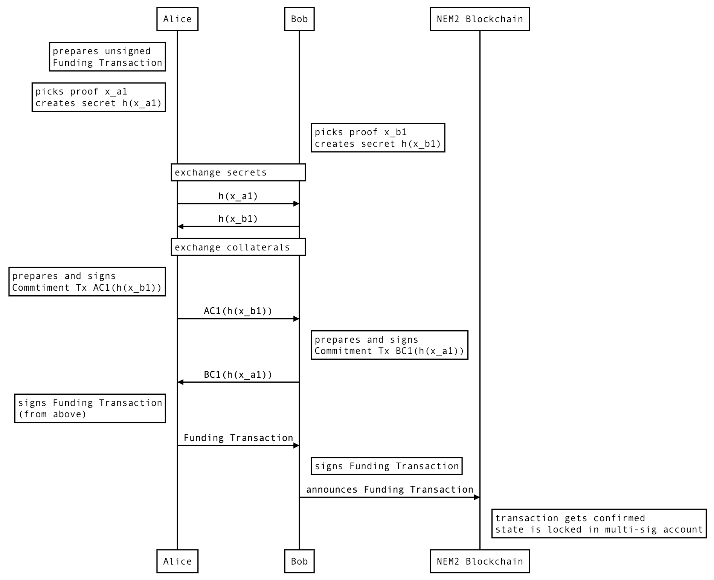
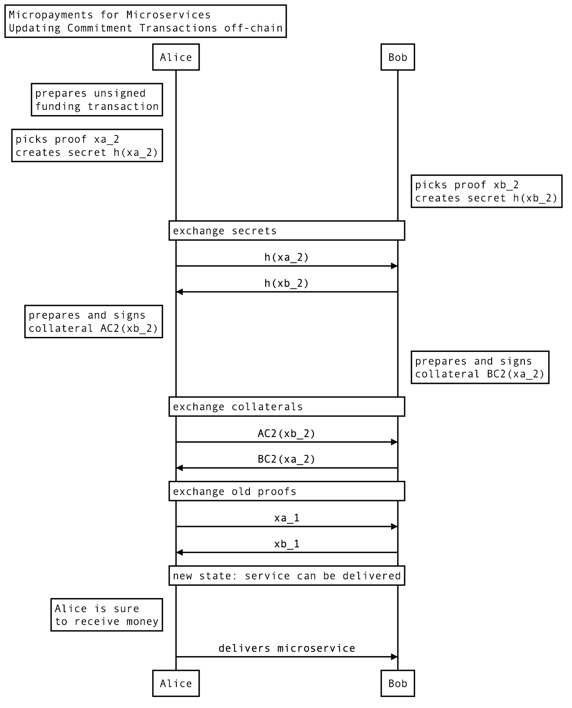

# bidirectional-nem2-payment-channel-sample

	                                                                                                      
	                                                                                                      
	                                                                                                      
	          __    _       __    __        _                _   __     __                      __        
	         / /   (_)___ _/ /_  / /_____  (_)___  ____ _   / | / /__  / /__      ______  _____/ /__      
	        / /   / / __ `/ __ \/ __/ __ \/ / __ \/ __ `/  /  |/ / _ \/ __/ | /| / / __ \/ ___/ //_/      
	       / /___/ / /_/ / / / / /_/ / / / / / / / /_/ /  / /|  /  __/ /_ | |/ |/ / /_/ / /  / ,<         
	      /_____/_/\__, /_/ /_/\__/_/ /_/_/_/ /_/\__, /  /_/ |_/\___/\__/ |__/|__/\____/_/  /_/|_|        
	              /____/                        /____/                                                    
	                                 ____              _   __________  ______                             
	                                / __/___  _____   / | / / ____/  |/  /__ \                            
	                               / /_/ __ \/ ___/  /  |/ / __/ / /|_/ /__/ /                            
	                              / __/ /_/ / /     / /|  / /___/ /  / // __/                             
	                             /_/  \____/_/     /_/ |_/_____/_/  /_//____/                             
	                                                                                                      
	                                                                                                      
	                                                                                                      

For English scroll down

双方向NEM2ペイメントチャネルのサンプル

NEM2カタパルトで双方向ペイメントチャネルするには その１ 概要
https://qiita.com/planethouki/items/c22a21836d913418de82

NEM2カタパルトで双方向ペイメントチャネルするには その２ トランザクションは作れるのか
https://qiita.com/planethouki/items/53415a14b34bebd450fc

NEM2カタパルトで双方向ペイメントチャネルするには その３ ペイロードの送信と罰則
https://qiita.com/planethouki/items/945239fe04d2af1fb203

---
#Bidirectional Payments between Two Parties
This document describes a Lightning Network implementation for NEM2 (codename Catapult). This approach does not introduce new transaction types, but manages to use readily available features. A combination of Multi-Signature, Aggregate Complete and Secret Lock Transactions, the latter is the NEM counterpart of Hashed Timelock Contracts (HTLC). Following the protocol laid out in this repository, one can execute scaleable off-chain transactions with NEM already today!   

> Simplicity is the ultimate sophistication.
 (Leonardo da Vinci)

A Lightning Network is a second layer protocol that allows users to send an (almost) unlimited number of transactions between parties without involving the blockchain, except at opening and closing the respective channel. Among other aspects, most importantly the protocol is designed in such a way that no funds can be stolen by cheating parties.

The flowcharts below show the major steps at a different level of abstraction.

	┌──────────────────┐      ┌──────────────────┐     ┌──────────────────┐                   
	│                  │      │                  │     │                  │                   
	│                  │      │                  │     │                  │                   
	│   Open Channel   │      │Perform Lightning │     │  Close Channel   │                   
	│                  │─────▶│     Payments     │──┬─▶│                  │                   
	│                  │  ▲   │                  │  │  │                  │                   
	│                  │  │   │                  │  │  │                  │                   
	└──────────────────┘  │   └──────────────────┘  │  └──────────────────┘                   
	                      │                         │                                         
	                      │                         │                                         
	                      └───repeat instant tx at ─┘                                         
	                             almost no cost                                               
	                                                                                          
	                                                                                          
	┌──────────────────┐      ┌──────────────────┐     ┌──────────────────┐                   
	│                  │      │   Update state   │     │                  │                   
	│                  │      │    off-chain     │     │                  │                   
	│    Lock state    │      │                  │     │    Close out     │                   
	│     on-chain     │─────▶│ using a message  │──┬─▶│     on-chain     │                   
	│                  │  ▲   │  transportation  │  │  │                  │                   
	│                  │  │   │      layer       │  │  │                  │                   
	└──────────────────┘  │   └──────────────────┘  │  └──────────────────┘                   
	                      │                         │                                         
	                      │                         │                                         
	                      └───repeat instant tx at ─┘                                         
	                             almost no cost                                               
	                                                                                          
	                                                                                          
	┌──────────────────┐      ┌──────────────────┐     ┌─────────────────────────────────────┐
	│                  │      │                  │     │   Aggregate Complete (bilateral)    │
	│ Commitment Tx A1 │      │                  │     │                                     │
	│ Commitment Tx B1 │      │ Commitment Tx An │     │  Commitment An or Bn (unilateral)   │
	│    Funding Tx    │─────▶│ Commitment Tx Bn │──┬─▶│                                     │
	│                  │   ▲  │                  │  │  │Commitment & SecretProofTx (cheating)│
	│                  │   │  │                  │  │  │                                     │
	└──────────────────┘   │  └──────────────────┘  │  └─────────────────────────────────────┘
	                       │                        │                                         
	                       │                        │                                         
	                       └─────repeat until n─────┘                                         
	                                                                                          
	                                                                                                                                                                                
	                                                                                                       --- 
	                                                                                                                                                                  
# Open Channel	          
                                                                                             

# Update Channel
     

# Close Channel

 	                                  ┌──────────────────────────────────┐      ┌───────────────────┐                                                                   
	                                  │      either of the parties       │      │                   │                                                                   
	               ┌──────────┐       │          creates final           │      │ other party signs │                                                                   
	     ┌────────▶│bilateral │──────▶│      Aggregate Complete Tx       │─────▶│ and announces to  │───────┐                                                           
	     │         └──────────┘       │with the newest balance (state n) │      │    blockchain     │       │       ┌───────────────────┐                               
	     │                            └──────────────────────────────────┘      │                   │       │       │     close out     │                               
	     │                                                                      └───────────────────┘       │       │according to agreed│                               
	     │                            ┌──────────────────────────────────┐      ┌───────────────────┐       ├──────▶│  off-chain state  │───────────────┐               
	┌─────────┐                       │ one party is not responsive and  │      │balance of         │       │       │                   │               │    ┌─────────┐
	│█████████│    ┌──────────┐       │ the remaining one announces most │      │announcing party is│       │       └───────────────────┘               │    │█████████│
	│██Start██│───▶│unilateral│──────▶│ recent Commitment Tx ACn or BCn  │─────▶│locked up until    │───────┘                                           ├───▶│███End███│
	│█████████│    └──────────┘       │                                  │      │LockFundsTx expires│                                                   │    │█████████│
	└─────────┘                       └──────────────────────────────────┘      └───────────────────┘                                                   │    └─────────┘
	     │                            ┌──────────────────────────────────┐      ┌───────────────────┐    ┌──────────────────┐   ┌──────────────────┐    │               
	     │                            │                                  │      │balance of         │    │ victim announces │   │  cheater loses   │    │               
	     │         ┌──────────┐       │  cheating party announces state  │      │announcing party is│    │SecretProofTx with│   │deposit, the other│    │               
	     └────────▶│ cheating │──────▶│   that is NOT the most recent    │─────▶│locked up until    │───▶│    Proof from    │──▶│party receives all│────┘               
	               └──────────┘       │                                  │      │LockFundsTx expires│    │previous round(s) │   │      funds       │                    
	                                  └──────────────────────────────────┘      └───────────────────┘    └──────────────────┘   └──────────────────┘                                                
	                                                                                                              
	                                                                                                                                                                                           
---

	         Funding Transaction                         Commitment Transaction AC1                  Commitment Transaction BC1     
	                                                                                                                                
	┌────────┐                ┌────────┐           ┌────────┐                  ┌────────┐     ┌────────┐                  ┌────────┐
	│        │                │        │           │        ├─ ── ── ── ── ── ─┤        │     │        ├─ ── ── ── ── ── ─┤        │
	│ Alice  │                │  Bob   │           │ Alice  │                  │  Bob   │     │ Alice  │                  │  Bob   │
	│        ├ ── ── ── ── ── ┤        │           │        │◁━━━━━━━━━━━━━━━━━│        │     │        │━━━━━━━━━━━━━━━━▷ │        │
	└─┬──────┘                └───────┬┘           └────────┘  Secret Lock Tx  └────────┘     └────────┘  Secret Lock Tx  └────────┘
	     ┃                         ┃  │               │ ▲       5 XEM h(x_b1)       ▲ │          │ ▲       5 XEM h(x_a1)       ▲ │  
	  │  ┃                         ┃                  │ ┃                           ┃ │          │ ┃                           ┃ │  
	  │  ┃                         ┃  │                                             ┃                                          ┃    
	     ┃                         ┃  │               │ ┃                           ┃ │          │ ┃                           ┃ │  
	  │ 5 XEM━━━┓         ┏━━━5 XEM┛                  │ ┗━━━5 XEM━┓       ┏━5 XEM━━━┛ │          │ ┗━━━5 XEM━┓       ┏━5 XEM━━━┛ │  
	  │         ┃         ┃           │                           ┃       ┃                                  ┃       ┃              
	         aggregate complete tx    │               │      aggregate complete tx    │          │      aggregate complete tx    │  
	  └─ ── ── ─╋ ── ── ──┃── ── ── ──                └ ── ── ── ─╋ ── ── ╋─ ── ── ── ┘          └ ── ── ── ─╋ ── ── ╋─ ── ── ── ┘  
	            ▼         ▼                                       ┃       ┃                                  ┃       ┃              
	          ┌─────────────┐                                  ┌─────────────┐                            ┌─────────────┐           
	          │             │                                  │             │                            │             │           
	          │   deposit   │                                  │   deposit   │                            │   deposit   │           
	          │ (multi-sig) │                                  │ (multi-sig) │                            │ (multi-sig) │           
	          │             │                                  │             │                            │             │           
	          └─────────────┘                                  └─────────────┘                            └─────────────┘           